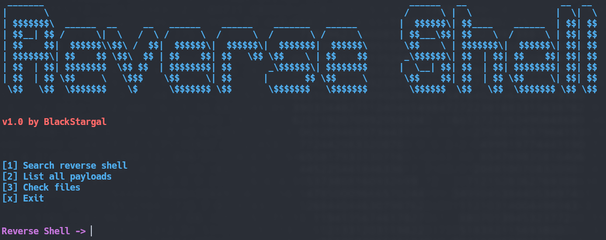
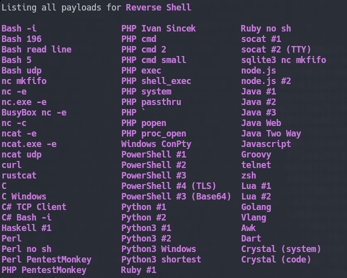
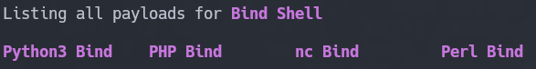
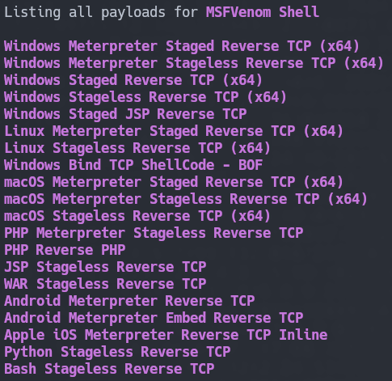

# Reverse Shell CLI
This is a script for generating reverse shells, bind shells and msfvenom shells.

# Setup

```bash
git clone https://github.com/BlackStargal/ReverseShellCLI.git
cd ReverseShellCLI
chmod +x reverseShellCLI.sh
./reverseShellCLI.sh
```

# Screenshots

## Reverse Shell Payloads

## Bind Shell Payloads

## MSFVenom Shell Payloads

